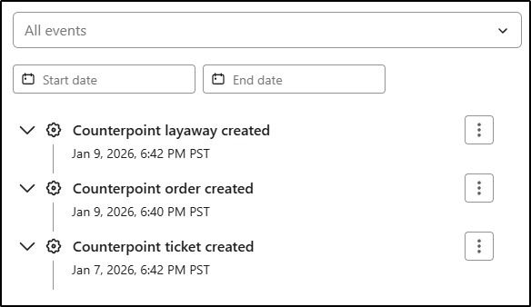
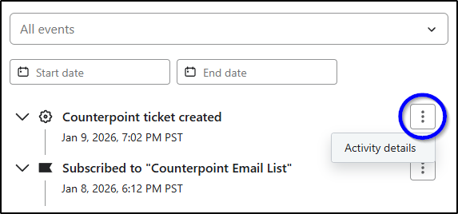
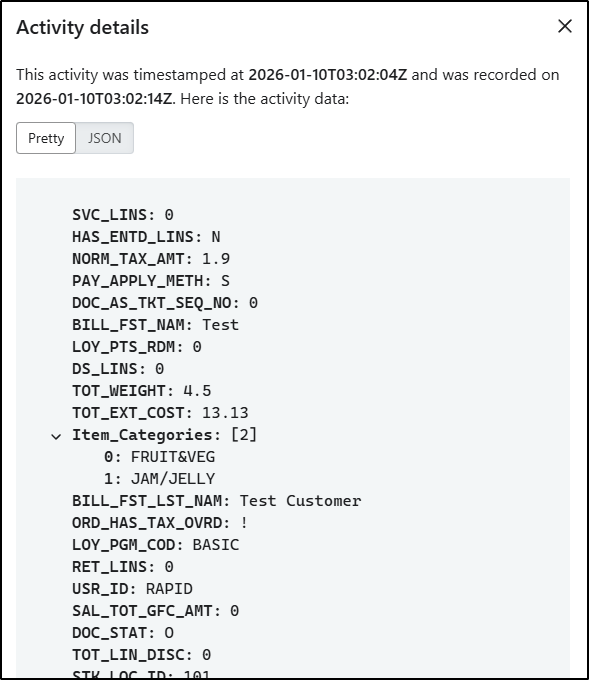
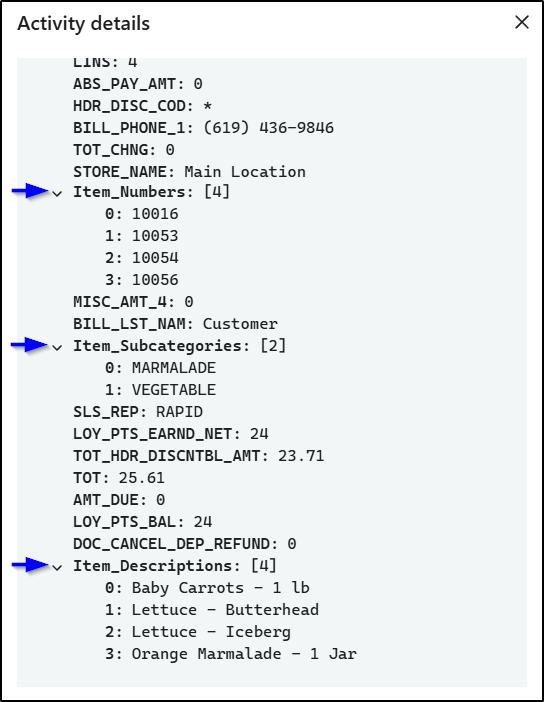
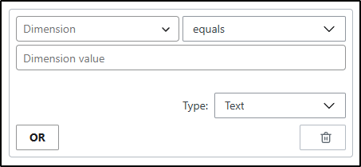
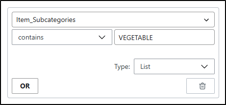
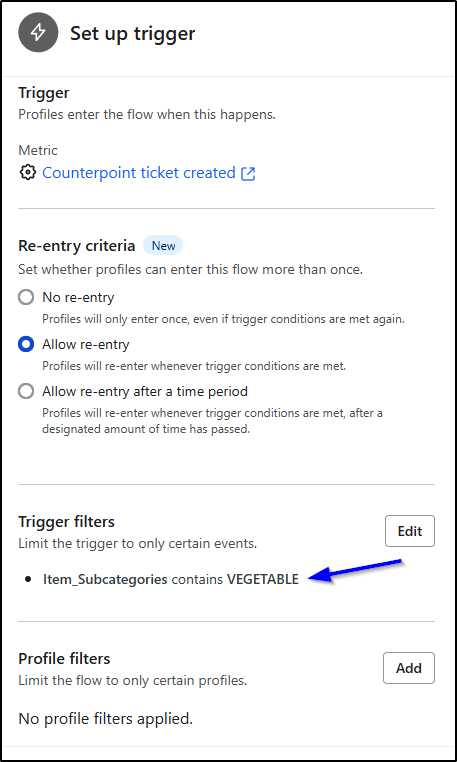
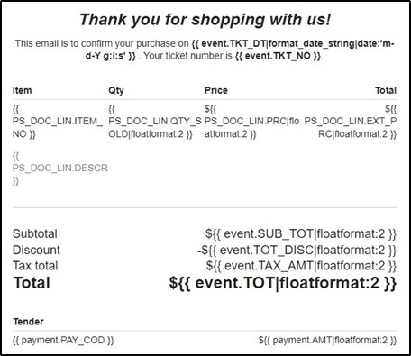

# Metrics and Transactional Email Guide
## Rapid POS Klaviyo Connector

**Version:** 3.3  
**Updated:** January 9, 2026  

---

## Overview

This document provides detailed guidance on **Klaviyo metrics**, **dimensions**, and **transactional email usage** when using the Rapid POS Klaviyo Connector.

It is intended to be a **companion document** to the primary *Rapid POS Klaviyo Connector README*. While the main README focuses on connector configuration, sync behavior, and operational controls, this guide explains:

- How transactional data from Counterpoint is represented in Klaviyo  
- How metrics and dimensions work  
- How this data can be used in Klaviyo flows and email templates  

This document does **not** provide instruction on marketing strategy or email design best practices.

---

## Table of Contents

- [1. Klaviyo Metrics from Counterpoint](#2-klaviyo-metrics-from-counterpoint)
  - [1.1 Automatically Synced Metrics](#21-automatically-synced-metrics)
  - [1.2 Accessing Metric Data in Klaviyo](#22-accessing-metric-data-in-klaviyo)
  - [1.3 Metric Structure and Dimensions](#23-metric-structure-and-dimensions)
  - [1.4 Dimension Levels and Filtering Rules](#24-dimension-levels-and-filtering-rules)
  - [1.5 Elevating Detail Fields to Top-Level Dimensions](#25-elevating-detail-fields-to-top-level-dimensions)
  - [1.6 Standard Metric Properties](#26-standard-metric-properties)
  - [1.7 Setting Up Trigger Filters](#27-setting-up-trigger-filters)
- [2. Sending Emails Using Klaviyo](#3-sending-emails-using-klaviyo)
  - [2.1 Disclaimer](#31-disclaimer)
  - [2.2 Marketing vs. Transactional Emails](#32-marketing-vs-transactional-emails)
  - [2.3 Transactional Email Requirements](#33-transactional-email-requirements)
  - [2.4 Metric Properties and Personalization Variables](#34-metric-properties-and-personalization-variables)
  - [2.5 Hints for Transactional Email Receipts](#35-hints-for-transactional-email-receipts)
- [3. Reference Links and Additional Notes](#4-reference-links-and-additional-notes)

---

## 1. Klaviyo Metrics from Counterpoint

Documents including **tickets**, **orders**, and **layaways** are automatically sent from Counterpoint to Klaviyo as **metrics**.

While this data is always sent, none of it is required to be used unless desired.

These metrics can be used to:
- Trigger Klaviyo flows  
- Build segments  
- Generate insights  
- Support transactional and marketing emails  

All metrics appear in Klaviyo with the source labeled as **API**. 

---

### 1.1 Automatically Synced Metrics

The following metrics are sent to Klaviyo for customers who have Klaviyo profiles:

#### Ticket Events
- Created  
- Voided  

#### Order Events
- Created  
- Edited  
- Reinstated  
- Released*  
- Canceled  

#### Layaway Events
- Created  
- Edited  
- Reinstated  
- Released*  
- Canceled  

\* **Important Note**  
Order and layaway releases appear in Klaviyo as **Counterpoint Ticket Created** events.  
They can be identified by filtering for:
- `DOC_TYP = T`  
- `IS_REL_TKT = Y`  

---

### 1.2 Accessing Metric Data in Klaviyo

To view metric data for a customer:

1. Open the customer profile in Klaviyo  
2. Locate the desired event  
3. Click the **three dots** next to the event  
4. Select **Activity details**  

Each field displayed in the activity details represents a **dimension** and its associated value.

---

### 1.3 Metric Structure and Dimensions

Each Klaviyo metric consists of **dimensions**, which are fields sourced from Counterpoint.

#### Document Header Details
- `DOC_ID` – Unique document ID  
- `STR_ID` – Store ID  
- `TKT_NO` – Ticket number  
- `TKT_TYP` – Ticket type  

#### Document Line Details
- `ITEM_NO` – Item number  
- `DESCR` – Item description  

#### Document Payment Details
- `PAY_COD` – Pay code  

A complete list of available dimensions, descriptions, and valid values is available upon request in the **Klaviyo Connector Metric Properties Reference Guide**. Fields will only appear in Klaviyo if a value exists in Counterpoint.

**Technical Note**
- Document header data is sourced from a custom view (`USER_VI_PS_DOC_HDR_KLAVIYO`) to reduce the number of fields sent and comply with Klaviyo API rate limits.  
- Document line and payment data are sourced from standard point-of-sale tables in Counterpoint (`PS_DOC_LIN`, `PS_DOC_PMT`).

---

### 1.4 Dimension Levels and Filtering Rules

Klaviyo applies different rules depending on the level of a dimension:

- **Top-Level Dimensions**
  - **Can be used to filter flow triggers**  
  - All document header fields are top-level  

- **Detail-Level (Nested) Dimensions**
  - Can be used as values within emails  
  - **Cannot be used to filter flow triggers**  
  - Includes document line and payment data  

---

### 1.5 Elevating Detail Fields to Top-Level Dimensions

To work around Klaviyo’s filtering limitations, the connector can resend selected detail-level fields as **top-level dimensions**.

- Values are pulled from document lines  
- Multiple values are combined when applicable  
- Up to **eight** fields can be elevated using the **Klaviyo Custom Properties – Documents Up** configuration
  - Reference the README file for more details on configuring Custom Properties for Documents Up: [Klaviyo Custom Properties – Documents Up](./README.md#section-5-klaviyo-custom-properties--documents-up)

---

### 1.6 Standard Metric Properties

The following properties are included in a standard deployment:

| Property Source | Level | Nested or Not Nested |
|-----------------|-------|--------|
| `VI_PS_DOC_HDR` fields | Top-Level | Not Nested |
| `PS_DOC_LIN` fields | Detail-Level | Nested |
| `PS_DOC_PMT` fields | Detail-Level | Nested |
| Item_Numbers | Top-Level | Nested |
| Item_Descriptions | Top-Level | Nested |
| Item_Categories | Top-Level | Nested |
| Item_Subcategories | Top-Level | Nested |
| Item_Primary_Vendor_Names | Top-Level | Nested |

---

### 1.7 Setting Up Trigger Filters

When building Klaviyo flow triggers:
- Only **top-level dimensions** can be used as trigger filters  
- Selecting a dimension (for example, `Item_Subcategories`) populates available values dynamically  
- Selected values can be used to precisely target flow execution  

**Trigger filter screen without values:**

**Trigger filter screen with values:**

**Set Up Trigger screen with sample trigger filter applied:**

---

## 2. Sending Emails Using Klaviyo

### 2.1 Disclaimer

Rapid POS specializes in the **Klaviyo connector and data synchronization** between Counterpoint and Klaviyo.

Rapid staff are **not email marketing experts**. For assistance with:
- Email design  
- Marketing strategy  
- Flow configuration  
- Segmentation best practices  

Please consult a **Klaviyo-experienced marketing professional or agency**.

---

### 2.2 Marketing vs. Transactional Emails

- **Transactional emails** include receipts, order confirmations, and delivery notifications  
- **Marketing emails** include welcome messages, promotions, and birthday/anniversary notifications  

Klaviyo’s definition:  
https://www.klaviyo.com/blog/transactional-email  

---

### 2.3 Transactional Email Requirements

Klaviyo requires transactional emails to:
- Be triggered by a **metric-based flow**  
- Receive **pre-approval**, which may take up to one business day  

Approval guidance:  
https://help.klaviyo.com/hc/en-us/articles/360003165732  

---

### 2.4 Metric Properties and Personalization Variables

Metric properties and personalization variables can be inserted into Klaviyo email templates.

Important notes:
- Variables are **case sensitive**  
- HTML knowledge is helpful when customizing templates  
- Assistance with metric clarification from Rapid is billed at T&M rates  

If a desired property is not available, consult Rapid for a quote to sync additional data.

Klavyio's Message Personalization Reference:  
https://help.klaviyo.com/hc/en-us/articles/4408802648731  

---

### 2.5 Hints for Transactional Email Receipts

Klaviyo users are responsible for:
- Creating receipt flows  
- Designing email templates  
- Applying for transactional approval from Klaviyo  

**Recommended approach**
- Use the **Counterpoint Ticket Created** metric  
- Optionally filter flows based on:
  - Customer email receipt preferences  
  - Ticket-level receipt delivery indicators
 
**Sample Email Receipt Template**

**Note:** Some properties may benefit from formatting filters (for example, decimal precision).

Klaviyo's Filter Reference:  
https://developers.klaviyo.com/en/docs/use_filters_to_customize_variables  

---

## 3. Reference Links and Additional Notes

This document intentionally focuses on **data behavior and usage**, not marketing strategy. 

This guide is intended to be used alongside the primary connector documentation. For connector setup, configuration, sync behavior, and operational controls, see the [Rapid POS Klaviyo Connector README](./README.md).

For marketing guidance, consult Klaviyo's documentation or a marketing professional with Klaviyo expertise.
