# Rapid POS Klaviyo Connector - Version 3.3
Updated 1/9/2026

---

## Overview

The Rapid Klaviyo Connector automatically syncs customer and sales data from Counterpoint to Klaviyo to support targeted email and SMS marketing, customer segmentation, and automated flows. The connector syncs customer profiles and transaction information for customers with a populated **Email Address 1** in Counterpoint.

If configured, **Phone 1** or **Mobile Phone 1** can be included to support Klaviyo SMS marketing.

---

## Minimum System Requirements

- Minimum Counterpoint version: **8.5.6.2**  
- Minimum SQL Server version: **2016**  
- Minimum Windows Server version: **2016**  
- Minimum PowerShell version: **5.1**  

If you would like the Klaviyo connector but your system does not meet these minimum requirements, please consult your Care Team Lead (vCIO) for an upgrade quote.

---

## Table of Contents

- [Minimum System Requirements](#minimum-system-requirements)
- [Section 1: Klaviyo Customer Records](#section-1-klaviyo-customer-records)
- [Section 2: Klaviyo Configuration](#section-2-klaviyo-configuration)
- [Section 3: Klaviyo Field Mapping – Customers Up](#section-3-klaviyo-field-mapping--customers-up)
- [Section 4: Klaviyo Field Mapping – Customers Down](#section-4-klaviyo-field-mapping--customers-down)
- [Section 5: Klaviyo Custom Properties – Documents Up](#section-5-klaviyo-custom-properties--documents-up)
- [Section 6: Klaviyo Custom Events](#section-6-klaviyo-custom-events)
- [Section 7: Klaviyo Profile Custom Properties](#section-7-klaviyo-profile-custom-properties)
- [Section 8: Queued to Be Sent to Klaviyo](#section-8-queued-to-be-sent-to-klaviyo)
- [Section 9: Klaviyo Customer Status View](#section-9-klaviyo-customer-status-view)
- [Section 10: Run Klaviyo Connector Button](#section-10-run-klaviyo-connector-button)
- [Section 11: Mark All Klaviyo Messages as Read](#section-11-mark-all-klaviyo-messages-as-read)
- [Section 12: Klaviyo Connector Execution and Sync Timing](#section-12-klaviyo-connector-execution-and-sync-timing)
- [Section 13: Customer Profile Sync Logic and Workflow](#section-13-customer-profile-sync-logic-and-workflow)
- [Section 14: Managing Customer Email and Phone Updates](#section-14-managing-customer-email-and-phone-updates)
- [Conclusion](#conclusion)

---

## SECTION 1: Klaviyo Customer Records

The Klaviyo Connector adds a **Klaviyo Customers** button within Counterpoint, providing access to Klaviyo-specific customer fields directly from the Counterpoint customer record.

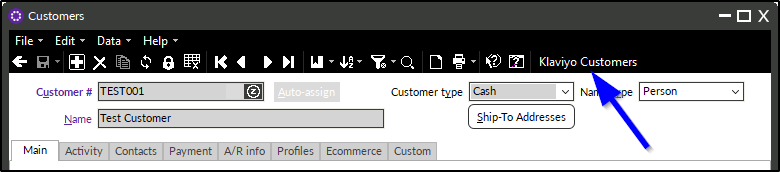

The email address on the Klaviyo customer record is populated from **Email Address 1** on the Counterpoint customer record.

Depending on configuration, the SMS phone number is populated from either **Phone 1** or **Mobile Phone 1** on the Counterpoint customer record, **only when it meets the following criteria**:
- Contains **exactly 10 numeric digits**
- Does **not** include letters 

If the configured phone number field contains more than or fewer than 10 digits, or if it includes letters, the SMS number will **not** be pushed to Klaviyo.

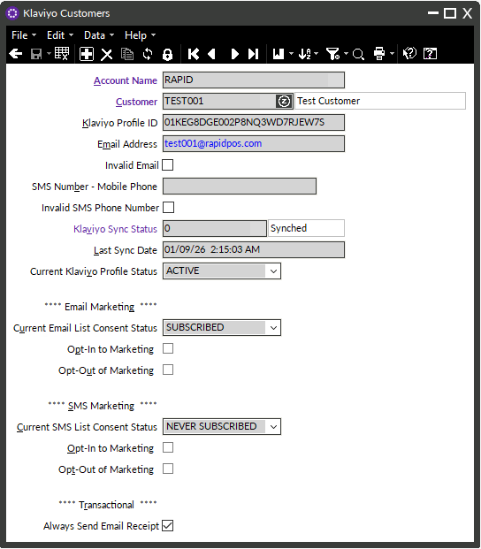

### Accessing Klaviyo Customer Records

All Klaviyo customer records can also be accessed from:

**Connectors > Klaviyo > Klaviyo Customer Records**

This view allows records to be displayed in **table view**, where filters can be applied to review customers based on their current sync status.

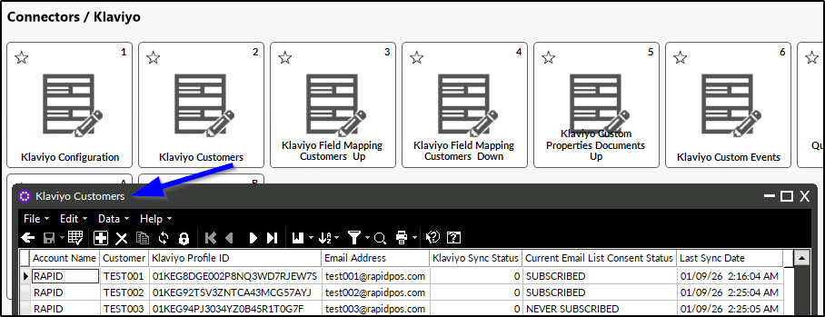

### Klaviyo Sync Status Codes

Each Klaviyo customer record includes a sync status value indicating its current state in the sync process:

- **0** – Fully synced; nothing pending  
- **1** – Recently created or updated; will sync on the next connector run  
- **2** – Profile is currently in the active sync queue  
- **5** – Invalid email address  
- **6** – Invalid SMS number  
- **9** – Sync error; requires remediation before it can be re-synced  

### Add-on-the-Fly Klaviyo Customer Form (Optional)

An optional **Klaviyo Customers Add-on-the-Fly** form can be configured to give cashiers limited access to Klaviyo customer records, if desired.

Please contact Rapid for a quote if you are interested in a customized add-on-the-fly form for your company.

---

## SECTION 2: Klaviyo Configuration

The Klaviyo Connector includes a user interface for managing configuration options that control how the connector interacts with Klaviyo and Counterpoint.  

For clients who use **multiple Klaviyo accounts**, a separate configuration record will exist for each account.

### Account Name
- Identifies the Klaviyo account.
- Especially important for companies with more than one Klaviyo account (for example, separate accounts for a retail store and a restaurant).

### Is Enabled?
- Used to temporarily disable the connector while troubleshooting or testing.

### Workgroup ID
- Workgroup **231** will be created and used when inserting new customer records from Klaviyo into Counterpoint.
- The associated Customer Template for this workgroup is applied during customer creation.

### Auto Create Klaviyo Profile
Controls when Klaviyo customer records are automatically created from Counterpoint.

- **EMAIL ONLY**  
  A Klaviyo customer record is automatically created when a customer is added to Counterpoint with **Email Address 1**.  
  - If the configured phone number (**Mobile Phone 1** or **Phone 1**) is also present, it will be included on the Klaviyo profile.
  - SMS subscription configuration is handled separately.

- **NO**  
  Klaviyo customer records must be created manually.

- **BOTH**  
  A Klaviyo customer record is automatically created only when both **Email Address 1** *and* the configured phone number (**Mobile Phone 1** or **Phone 1**) are present.

- **Note:**  
  **SMS ONLY** is currently a placeholder for potential future development. At this time, **all customers must have an email address** to be synced to Klaviyo.

### Always Send Email Receipt Default
The **Send Email Receipt** flag on the Counterpoint customer record does not have standalone functionality within Counterpoint. Instead, it is sent to Klaviyo and can be used to control Klaviyo flows related to receipt delivery.

- **Checked**  
  Automatically flags **Send Email Receipt** on the Klaviyo customer record.  
  This establishes a default behavior indicating that receipts should be emailed for that customer. Individual customer records can still be adjusted manually.

- **Unchecked**  
  The **Send Email Receipt** flag must be set manually on each customer record.

#### Using a Ticket-Level Receipt Indicator (Advanced Option)
Some clients choose to control receipt delivery at the **ticket level** rather than at the customer level by using a custom ticket header field, commonly named:

`USER_RCPT_DELIV_METHD`

This field is typically populated with a value indicating how the receipt should be delivered for that **specific ticket**, such as:
- **E** – Email receipt
- **P** – Print receipt

When this ticket-level indicator is used:
- Receipt delivery is determined **per ticket**, independent of the customer’s **Send Email Receipt** setting.
- The **Always Send Email Receipt Default** configuration can be ignored as it applies only to the customer record default.
- Klaviyo flows can be built to evaluate this ticket-level value to decide whether a receipt email should be sent.

### Counterpoint Email & SMS Lists
These lists are used to manage subscriptions and control which customer profiles receive **email and SMS communications** originating from Counterpoint data.

During initial setup:
- If no existing lists are specified, the connector will automatically create a **Counterpoint Email List**  and a **Counterpoint SMS List** in Klaviyo.

For clients who already use Klaviyo, the connector can be configured to use one or more **existing Klaviyo lists** instead of creating new ones. This is common when companies want Counterpoint data to flow into an established marketing list.

- Klaviyo **List IDs** are configured in this section.
- List IDs can be located in Klaviyo under **List Settings > List Details**.

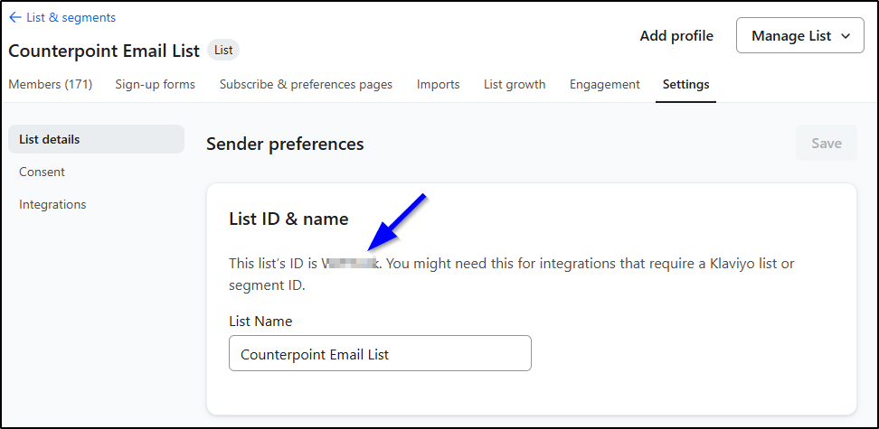

### Auto Opt-In by Default
Optional automation designed to reduce manual steps during customer creation.

- **Checked**  
  The opt-in box is automatically flagged when creating a new Klaviyo customer record.

- **Unchecked**  
  The opt-in box must be manually selected.

### Opt-In Definition
Currently, the only supported opt-in definition is **Subscribed**.

Behavior depends on Klaviyo list settings:
- **Single opt-in lists** typically accept the subscription.
- **Double opt-in lists** often set the subscription to *Never Subscribed* until the customer confirms via email or SMS.
- Klaviyo may reject subscription requests for suppressed profiles, previously unsubscribed contacts, or invalid email addresses.  
  Rapid can send the request, but cannot control Klaviyo’s response.

### Opt-Out Definition
Defines how opt-outs are sent to Klaviyo:

- **Unsubscribed**  
  Opt-outs are pushed to Klaviyo as unsubscribed from the list.

- **Suppressed**  
  Opt-outs are pushed as suppressed profiles.  
  This typically affects email lists only and does not appear to impact SMS lists.

### Phone # for Klaviyo
Defines which Counterpoint Customer Record phone number field is used to populate the Klaviyo **SMS Number – Mobile Phone** profile property.
- Supported options:
  - **Mobile Phone 1**
  - **Phone 1**
- If the selected phone field does not meet the _exactly 10 numeric digits_ requirement, the phone number will not be sent to Klaviyo
- This setting controls **which phone number is populated**, not SMS subscription consent.

### SMS Country Code
- Klaviyo requires all SMS phone numbers to include a country code.
- Examples:
  - **+1** (United States and Canada)
  - **+52** (Mexico)

### Insert New Customer Records
Controls whether Klaviyo profiles can create new Counterpoint customer records.

- **Checked**  
  Klaviyo profiles that do not match an existing Counterpoint customer will be inserted into Counterpoint.
  - Customer records are created using fields configured in **Klaviyo Field Mapping – Customers Down** with an **Insert** action.
  - Commonly used when customer data originates from website sign-up forms.
  - Matching logic:
    1. Klaviyo Profile ID
    2. Email Address 1
  - If no match is found in either Counterpoint (`AR_CUST`) or Klaviyo customer records (`USER_KLAVIYO_CUST`), a new Counterpoint customer record is created.
  - All profiles changed since the last sync are evaluated, regardless of Klaviyo list membership.

- **Unchecked**  
  New Counterpoint customer records will not be created by the connector.

**Important Notes:**
- Updating existing Counterpoint customer records is **independent** of this setting. Refer to **SECTION 3: Klaviyo Field Mapping – Customers Down**.
- Importing customers can result in **duplicate records** if email addresses were not previously captured in Counterpoint.
- Duplicates can be merged manually, but this can be especially problematic for clients using **DL Scan** or **3310 forms**.
- Consult with your **Business Analyst**, **vCIO**, or **Project Manager** before enabling this feature.

### Capitalize Customer Fields Configuration Setting
This configuration setting to support automatic capitalization of customer fields during customer synchronization and processing.

When enabled, customer information such as names and address-related fields can be automatically converted to uppercase formatting to maintain consistency between CounterPoint and Klaviyo customer records.

### Ticket History Start and End Dates
- Enables syncing of previously posted (historical) tickets to Klaviyo.
- Intended for **one-time use only**.

**Important:**
- Do **not** enable this yourself. Consult with your Business Analyst.
- Running history syncs multiple times with overlapping dates will result in **duplicate data** in Klaviyo.
- If either date is left blank, historical tickets will not sync.
- After the specified date range is processed, the configuration automatically resets to null.

### Other Configuration Options
Additional configuration fields exist for internal use by Rapid programmers. These options are used to optimize performance or assist with troubleshooting and should not be modified by end users.

---

## SECTION 3: Klaviyo Field Mapping – Customers Up

The **Klaviyo Field Mapping – Customers Up** screen provides a user interface for managing which customer fields are sent from Counterpoint up to Klaviyo.

This table defines how customer profile data in Counterpoint maps to Klaviyo profile properties. The standard deployment includes a predefined set of fields that are automatically synced. Adjustments to this table should generally be performed by a programmer.

Note: This is best viewed in _table view_.

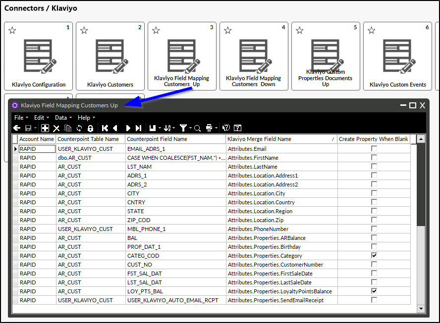

Calculated fields are not included by default. Any request to add calculated fields must be reviewed and quoted separately by Rapid.

**Note:** **Email Address 1** is a required field and must be sent to Klaviyo.

### Standard Customer Profile Fields Sent to Klaviyo

The following customer fields are included in a standard Klaviyo connector deployment:

1. Email Address 1  
2. Mobile Phone 1
3. Customer Number
4. First Name  
5. Last Name  
6. Address 1  
7. Address 2  
8. City  
9. State  
10. Zip Code  
11. Country  
12. A/R Balance  
13. Customer Category  
14. First Sale Date  
15. Last Sale Date  
16. Loyalty Point Balance  
17. Send Email Receipts (Yes/No)

---

## SECTION 4: Klaviyo Field Mapping – Customers Down

The **Klaviyo Field Mapping – Customers Down** table provides a user interface for managing which customer fields are imported from Klaviyo down into Counterpoint.

For clients using web-based sign-up forms or other Klaviyo integrations, this functionality allows customer data entered in Klaviyo to be imported into Counterpoint. This may include:
- Updating (overwriting) existing customer fields in Counterpoint
- Inserting new Counterpoint customer records when no matching record exists

Note: This is best viewed in _table view_.

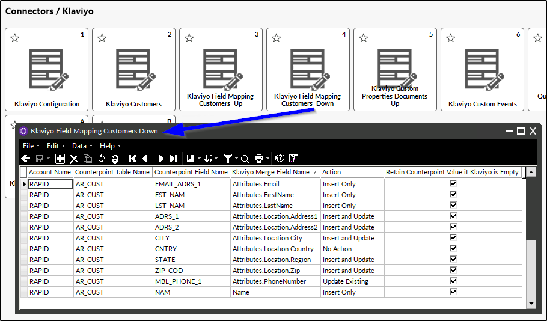

### Default Behavior

In a standard deployment, **no fields are imported** from Klaviyo. All fields in the table are set to **No Action** by default.

Any change to this behavior must be requested by the client, and a programmer will configure the table accordingly.

### Action Types

Each field in the **Customers Down** mapping table is assigned an action type that controls how Klaviyo data is applied in Counterpoint:

- **Insert Only**  
  The field is set by Klaviyo in Counterpoint **only when a new Counterpoint customer record is created**.

- **Update Existing**  
  When the field value changes in Klaviyo, the corresponding field in Counterpoint is updated.  
  This action does **not** set the field during new customer creation.

- **Insert and Update**  
  The field is set by Klaviyo when a new Counterpoint customer record is created, and it is also updated in Counterpoint when the value changes in Klaviyo.

- **No Action**  
  The field is not set or updated by Klaviyo in Counterpoint.

**Note:**  
- The two action types that include **Insert** only function when the configuration option **Insert New Customer Records** is enabled.  
- The two action types that include **Update** will function regardless of that configuration setting.

Use caution when selecting which Klaviyo fields are allowed to overwrite Counterpoint data. Consult with your **Business Analyst (BA)** for guidance before enabling field updates.

### Retain Counterpoint Value if Klaviyo is Empty

This setting controls how blank values from Klaviyo are handled during import:

- **Checked**  
  Counterpoint will **not** be updated with blank values from Klaviyo.  
  This prevents scenarios where a customer leaves a field blank on a web-based sign-up form, unintentionally overwriting existing Counterpoint data.

- **Unchecked**  
  Allows existing Counterpoint values to be overwritten with blank values from Klaviyo.  
  This setting is **not recommended**.

---

## SECTION 5: Klaviyo Custom Properties – Documents Up

Documents including **tickets**, **orders**, and **layaways** are automatically sent from Counterpoint to Klaviyo. These documents appear in Klaviyo as **metrics**.

This data is sent to Klaviyo for availability and flexibility, it does not need to be actively used. Once present, the metrics can be leveraged to build **flows**, **segments**, or **reporting**, if desired.

Most fields used to populate Klaviyo document metrics are **hard-coded** in the connector. However, additional configurable fields are available through the **Klaviyo Custom Properties – Documents Up** table.

Due to Klaviyo API rate limits, **up to eight** custom properties can be selected in this table.

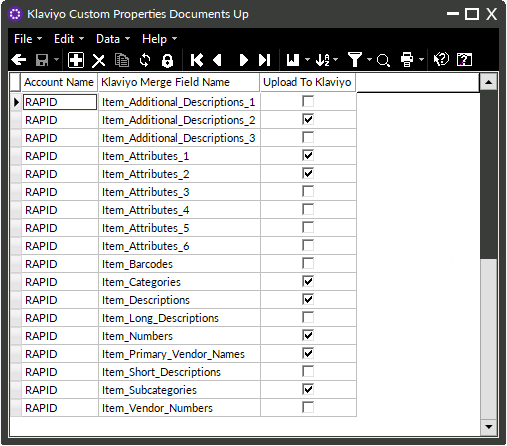

For more information on how documents are represented in Klaviyo, including the relationship between **metrics** and **dimensions**, refer to [Metrics and Transactional Email Guide](./METRICS-AND-TRANSACTIONAL-EMAIL-GUIDE.md).

---

## SECTION 6: Klaviyo Custom Events

Klaviyo does not allow flows to be scheduled based on a specific date field. The connector's **custom events** functionality can be used as a workaround to support date-driven automations.

The **Klaviyo Custom Events** table allows specific Counterpoint conditions to trigger custom event metrics that are sent to Klaviyo on a calculated date. These events can then be used to trigger Klaviyo flows.

This table is configured only by a programmer. Please contact Rapid for a quote if you are interested in sending custom events to Klaviyo.

### Example: Delivery Arriving Today Reminder

A ticket profile date stored in Counterpoint can be used to identify a scheduled delivery date. A custom event configured in the connector can push that ticket to Klaviyo **on the delivery date**.

Once received in Klaviyo, a flow can be triggered to send a delivery reminder email or SMS message to the customer.

For details about the **standard event metrics** that are automatically synced to Klaviyo, refer to [Metrics and Transactional Email Guide](./METRICS-AND-TRANSACTIONAL-EMAIL-GUIDE.md).

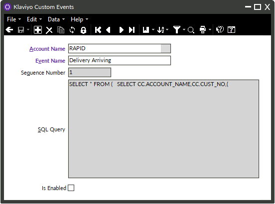

---

## SECTION 7: Klaviyo Profile Custom Properties

In some cases, it is useful to populate **custom profile properties** in Klaviyo — especially properties that are **calculated from historical ticket data** stored in Counterpoint. The **Klaviyo Profile Custom Properties** tool provides a flexible way to generate and sync these calculated values.

This feature allows users to define a custom profile property (as it will appear in Klaviyo) and specify how that value should be calculated. Calculations are typically based on ticket history data and can include aggregate functions such as totals, maximums, or averages over a defined date range.

### Example Use Case

For example, a user may want to sync the **total ticket subtotal for the first quarter of 2025** for customers who already have Klaviyo profiles. This could be configured as follows:

- **Property Name**: `TicketSubtotalQ1of2025`  
- **Table Name**: `PS_TKT_HIST`  
- **Column Name**: `SUB_TOT`  
- **Aggregate Function**: `SUM`  
- **Begin Date**: `01/01/2025`  
- **End Date**: `03/31/2025`

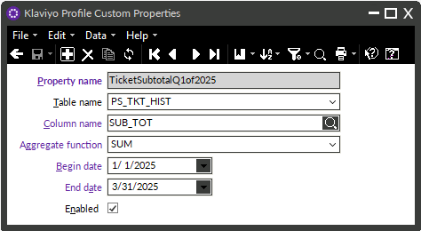

### How the Calculation Works

When a custom profile property is enabled:

- A **custom database view** is created to perform the calculation.
- Each view returns:
  - The **customer number**
  - The **calculated value** for the custom property
- The view is automatically added to **Klaviyo Field Mapping – Customers Up**.
- All customers included in the result set have their **Klaviyo Sync Status** set to `1`, triggering a resync to Klaviyo with the new property.

**Important notes:**
- If a customer does **not** have a calculated value, the custom property is **not sent** and will **not appear** on the Klaviyo profile.
- If a client has **multiple Klaviyo accounts**, the calculation is automatically performed for **all accounts**.

### Editing Existing Custom Properties

After the initial sync, the parameters of a custom property can be edited. Doing so will trigger another resync; however:

- Only customers included in the **new result set** will be recalculated.
- Customers outside the result set are **left unchanged**.

In general, it is recommended to create a new custom property rather than editing an existing one, especially when historical values need to be preserved.

### Profile Custom Property Definitions

The **Klaviyo Profile Custom Properties** tool includes a guided workflow with the following constraints:

#### Property Name
- Must be **unique** (acts as a primary key)
- Must **not contain spaces**
- Becomes the **permanent label** for the profile property in Klaviyo and **cannot be changed**

#### Data Sources
- Limited to:
  - `PS_TKT_HIST`
  - `PS_TKT_HIST_LIN`

#### Fields
- Restricted to **numeric fields only**

#### Aggregate Functions
- Supported values:
  - `SUM`
  - `MAX`
  - `MIN`
  - `AVG`
  - `COUNT`

#### Date Range
- A **begin date** and **end date** are required

#### Enabled
- When **enabled**, the custom profile property calculation becomes active.
- The connector begins evaluating customers against the defined criteria.
- Customers included in the result set have their **Klaviyo Sync Status** set to `1`, triggering a resync to Klaviyo with the calculated custom property.
- Disabling the property stops further calculations and syncs but does **not** remove the property from existing Klaviyo profiles.

---

## SECTION 8: Queued to Be Sent to Klaviyo

When sending metric data to Klaviyo, each document — including **tickets**, **orders**, **layaways** — is first placed into a queue in Counterpoint. Documents are then synced from this queue to Klaviyo during connector runs.

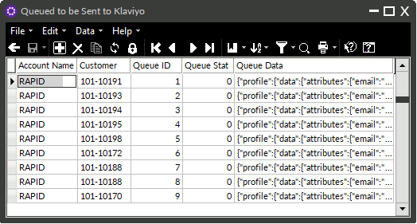

### Queue Status Values

Each document in the queue includes a status value indicating its current state in the sync process:

- **0** – Document has already been synced to Klaviyo; nothing pending  
- **1** – Document has been recently created or updated and will be added to the queue on the next connector run  
- **2** – Document is currently in the active sync queue  
- **9** – Document encountered an error and requires remediation before it can be re-synced

---

## SECTION 9: Klaviyo Customer Status View

Each Klaviyo customer record includes a **sync status** that indicates its current state in the connector process. In some cases, it is helpful to review how many customer records fall into a particular status category.

For example, you may want to identify that **43 customers have an invalid email address (status 5)** so those records can be reviewed and corrected.

The **Klaviyo Customer Status View** displays a summary table showing:
- Each sync status code (0, 1, 2, 5, 6, 9)
- The total number of customer records currently associated with that status

**Notes:**
- If no customer records exist for a given status, that status will **not** appear in the table.
- The table can be refreshed at any time to display the most up-to-date information.
- This is best viewed in _table view_.

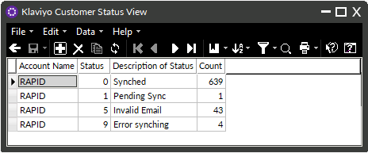

For details on the meaning of each customer sync status value, refer back to **SECTION 1: Klaviyo Customer Records**.

---

## SECTION 10: Run Klaviyo Connector Button

The **Run Klaviyo Connector** menu option allows authorized users to manually trigger the Klaviyo Connector when needed. Manual execution is typically used for testing or troubleshooting and is not required during normal operation.

### How Manual Execution Works

When the **Run Klaviyo Connector** menu option is selected:

- A **Manual Run Connector** action flag is set in the Klaviyo configuration.
- The flag functions as a **one-time execution request** and remains enabled until it is processed by the connector.
- Execution is handled in the background on the server (not on the workstation) to prevent overlapping executions.

### Background Processing and Scheduling

A background process periodically checks for the **Manual Run Connector** action flag based on a configurable **CRON schedule** stored in the Klaviyo configuration.

- The **Manual Run Connector Execution Time** schedule can be configured from the **Klaviyo Configuration** screen.
- When the action flag is detected:
  - If the Klaviyo connector is **not currently running**, it will execute for **all configured Klaviyo accounts**, typically within one minute.
  - If the connector **is already running**, the system waits for the current execution to complete, then automatically restarts the connector for all configured Klaviyo accounts.

In both scenarios, the action flag is **automatically cleared** when execution begins.

**Important:** Manual execution is intended primarily for **programmer-led testing or troubleshooting**, often when the connector has been **temporarily disabled**. It is not designed for routine operational use, as the connector runs automatically according to its configured schedule.

---

## SECTION 11: Mark All Klaviyo Messages as Read

The **Mark All Klaviyo Messages as Read** menu option allows users to suppress repeated pop-up alerts in Counterpoint while retaining all Klaviyo connector messages for later review.

This is especially useful in scenarios such as:
- Repeated error messages following a temporary internet outage
- High-volume alert conditions that have already been reviewed or acknowledged

Marking messages as read stops the pop-up notifications but does **not** delete the messages. All connector messages remain accessible in Counterpoint and can be reviewed at any time.
### Mail Group ID Support for Counterpoint Messaging Accounts

---

## SECTION 12: Klaviyo Connector Execution and Sync Timing

The Klaviyo Connector operates as a **Windows Service**, automatically syncing customer profiles and transactional documents between Counterpoint and Klaviyo.

The connector runs continuously in the background and is responsible for keeping both systems aligned while respecting Klaviyo API rate limits and configured sync rules.

### Sync Intervals

The connector processes different types of data on separate schedules:

- **Customer Profiles**  
  New and updated customer profiles are synced every **15 minutes**.

- **Documents in the Queue**  
  Transactional documents are synced every **1 minute**.  
  This interval is configurable and may be adjusted to prevent Klaviyo rate limiting.

If a document being synced contains a **new customer**, the customer profile is created in Klaviyo **immediately as part of the document sync**. The connector does not wait for the next 15-minute customer profile sync cycle.

For details on how customer profile changes are evaluated and synchronized between Klaviyo and Counterpoint, refer to **SECTION 13: Customer Profile Sync Logic and Workflow**.

---

## SECTION 13: Customer Profile Sync Logic and Workflow

This section describes the logical order and decision-making process used by the connector after a sync cycle begins.

The Klaviyo Connector processes customer profile updates in a defined sequence to ensure that the most recent and authoritative data is preserved between Counterpoint and Klaviyo.

### Step 1: Sync Changes from Klaviyo Down to Counterpoint

The connector first retrieves profile changes made in Klaviyo and evaluates whether those changes should be applied to Counterpoint.

- The connector compares the **date and time** of the most recent profile change in Klaviyo to the **date and time** of the most recent update in Counterpoint.
- The system uses the values from the source with the **most recent timestamp**.

Behavior depends on configuration settings:

- If **Insert/Update Customers** is **enabled**, all configured fields are synced down from Klaviyo to Counterpoint.
- If **Insert/Update Customers** is **disabled**, only **subscription status changes** are synced down.

### Step 2: Sync Changes from Counterpoint Up to Klaviyo

After processing inbound changes, the connector identifies customer records in Counterpoint that have been **created or modified** since the previous sync.

These updates are then pushed up to Klaviyo, ensuring that Klaviyo profiles reflect the most current customer information stored in Counterpoint.

---

## SECTION 14: Managing Customer Email and Phone Updates

When a customer is synced to Klaviyo, the connector stores the associated **Klaviyo Profile ID** on the customer record in Counterpoint. This Profile ID becomes the permanent link between the Counterpoint customer and the Klaviyo profile and is used for all future updates.  

Using the Profile ID ensures that customer history, engagement data, events, and flow activity are preserved in Klaviyo even when identifying information changes.

### Updating Email Address and Phone Number

If **Email Address 1** or the configured phone number (**Mobile Phone 1** or **Phone 1**) is updated in Counterpoint for a customer who already has a Klaviyo profile:

- The connector updates the email address or phone number on the **existing Klaviyo Profile ID**.
- A new Klaviyo profile is **not** created.
- The customer retains their full Klaviyo history, including events, metrics, and flow participation.

This behavior ensures continuity in Klaviyo while allowing customer contact information to be updated over time.

### Handling Duplicate Customer Records

The Klaviyo Connector enforces strict rules to prevent **duplicate Klaviyo profiles** and to maintain data integrity. Because Klaviyo profiles are uniquely identified by email address (per Klaviyo account), a single email address can only be associated with **one** Counterpoint customer record for that account.

The following scenarios describe how the connector behaves.

#### Scenario 1: Duplicate Email Addresses Already Exist in Counterpoint During Initial Setup

If the connector is installed and **multiple Counterpoint customers already share the same Email Address 1**:

- The connector creates or associates **one** Klaviyo profile for that email address.
- Only one Counterpoint customer record can be linked to that Klaviyo profile.
- Any additional Counterpoint customers using the same email address will **not** be able to create or associate their own Klaviyo customer record for that email address.

This behavior is expected and prevents duplicate Klaviyo profiles from being created during initial deployment.

#### Scenario 2: A Klaviyo Customer Record Already Exists and the Same Email Is Assigned to Another Counterpoint Customer

If a Klaviyo customer record already exists in Counterpoint for a given email address, and a user attempts to assign that **same Email Address 1** to a different Counterpoint customer record (either by editing an existing customer or creating a new one):

- Counterpoint blocks the action.
- An error is returned to the user.
- The connector does **not** allow a second Counterpoint customer to be linked to the same Klaviyo profile.

This prevents multiple Counterpoint customer records from sharing a single Klaviyo profile.

### Handling Merged Customers in Counterpoint

When two customer records are merged in Counterpoint:

- The Klaviyo customer record associated with the **“To”** customer (the retained record) remains linked to the Klaviyo profile.
- If the **“From”** customer had an associated Klaviyo customer record, that record becomes detached from any active customer.

It is recommended to **manually delete** the detached Klaviyo customer record after the merge. Otherwise, it will remain in Counterpoint with no functional association to an active Klaviyo profile.

---

## Conclusion

The Rapid Klaviyo Connector streamlines the exchange of customer profiles and transactional data between Counterpoint and Klaviyo, enabling powerful email and SMS marketing, accurate segmentation, and automated flows.

Before go-live, review configuration settings, field mappings, and list configurations to ensure customer data and subscription preferences are handled correctly. After deployment, monitor customer and document sync status views to identify invalid data or records requiring remediation.

For assistance with configuration changes, custom field mapping, event setup, or troubleshooting, contact Rapid Support.  

  
